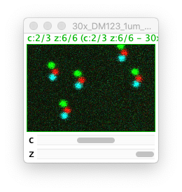

# Olympus DM correction ImageJ/Fiji plugin

**N.B. This plugin requires the BioFormats plugins (https://imagej.net/Bio-Formats)**

[Fiji](https://imagej.net/Fiji) comes with the BioFormats plugins pre-installed. If you are using regular [ImageJ](https://imagej.net) you will need to install the BioFormats plugins (see https://docs.openmicroscopy.org/bio-formats/5.8.2/users/imagej/installing.html).

## Installation
1. Close ImageJ/Fiji

2. Download zip file: [zoo_img_fac_plugins.zip](https://github.com/WaylandM/dichroic-mirror-offsets/blob/master/fiji_plugins/zoo_img_fac_plugins.zip?raw=true)

3. Unzip zoo_img_fac_plugins.zip to the plugins directory of ImageJ/Fiji.

When you restart ImageJ/Fiji you should see **Olympus DM correction** on the plugins menu under **Zoology Imaging Facility**:

## Use

