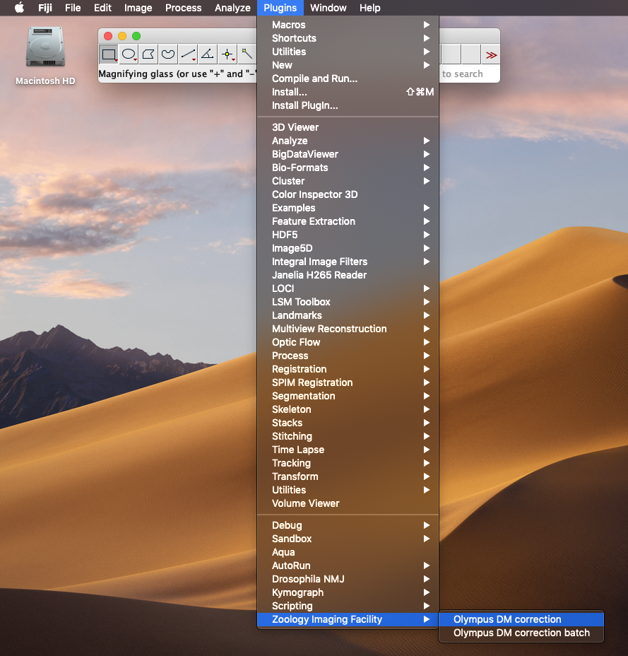

# ImageJ plugins for Olympus DM correction

**N.B. These plugins require the BioFormats plugins (https://imagej.net/Bio-Formats)**

[Fiji](https://imagej.net/Fiji) comes with the BioFormats plugins pre-installed. If you are using regular [ImageJ](https://imagej.net) you will need to install the BioFormats plugins (see https://docs.openmicroscopy.org/bio-formats/5.8.2/users/imagej/installing.html).

## Installation
1. Close ImageJ/Fiji

2. Download zip file: [zoo_img_fac_plugins.zip](https://github.com/WaylandM/dichroic-mirror-offsets/blob/master/fiji_plugins/zoo_img_fac_plugins.zip?raw=true)

3. Unzip zoo_img_fac_plugins.zip to the plugins directory of ImageJ/Fiji.

When you restart ImageJ/Fiji you should see **Olympus DM correction** and **Olympus DM correction batch** on the plugins menu under **Zoology Imaging Facility**:

***N.B. Mac OS X does not display titles on file dialogs, such as "open file" and "choose directory". To enable this behaviour in ImageJ, see [notes for mac users](notes_for_mac_users.md).***

## Use
Process individual Olympus image files (.oir) using **Olympus DM correction**. **Olympus DM correction batch** facilitates batch processing of files. Links to instructions for each plugin:

[**Olympus DM correction**](https://github.com/WaylandM/dichroic-mirror-offsets/blob/master/docs/single_file_plugin.md)

[**Olympus DM correction batch**](https://github.com/WaylandM/dichroic-mirror-offsets/blob/master/docs/batch_plugin.md) 

## Test data
Image data used to test these plugins are available on figshare:

| Date | DOI |
|---|---|
| 2019-07-25 | https://doi.org/10.6084/m9.figshare.11586930.v1 |
| 2020-01-02 | https://doi.org/10.6084/m9.figshare.11586984.v1 |
