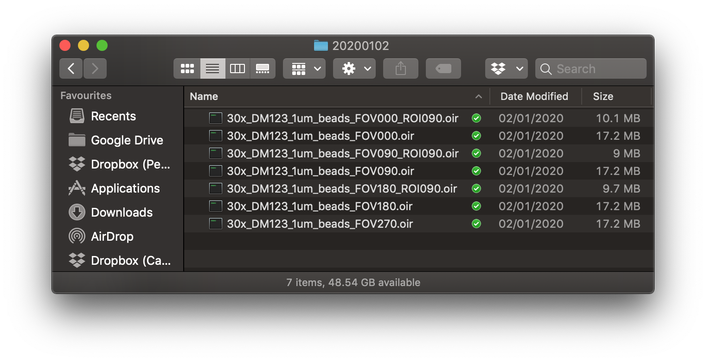
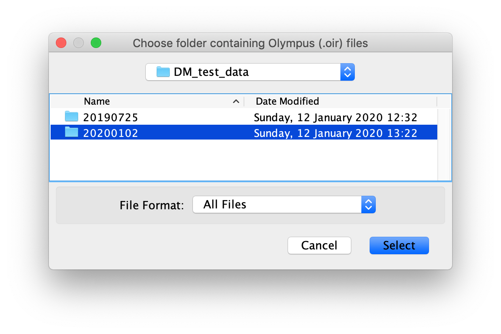
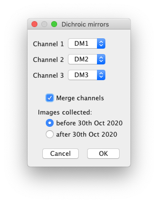
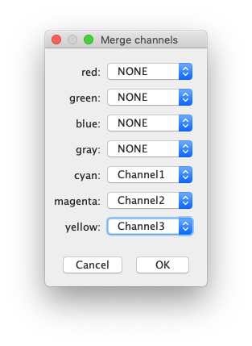
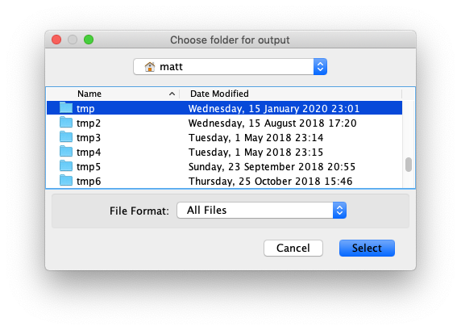
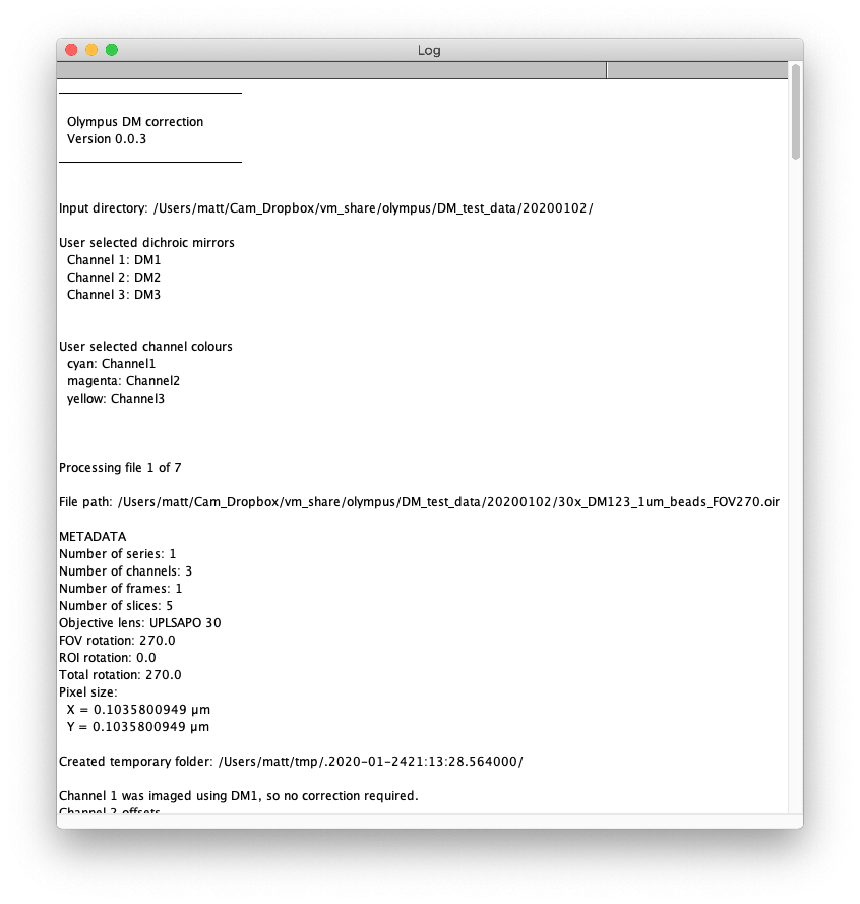

# Olympus DM correction batch

## Purpose
This ImageJ plugin corrects the alignment of channels in Olympus oir files. It can process batches in which all images were acquired using the same combination of dichroic mirrors. Individual files can be processed using [Olympus DM correction](https://github.com/WaylandM/dichroic-mirror-offsets/blob/master/docs/single_file_plugin.md).

## 1. Preparation
**Please note the following prerequisites for batch processing:**

* **All image files in a batch must contain the same number of channels.**
* **The same combination of dichroic mirrors should have been used to acquire all images in the batch.**

The batch of Olympus oir files should be placed in the same directory. There should be no other oir files in this directory.

## 2. Launch plugin
**Plugins -> Zoology Imaging Facility -> Olympus DM correction**

N.B. If you have large image files to process it is best not to have any images open in ImageJ/Fiji, to maximize the memory available to the plugin.

## 3. Choose directory containing Olympus oir files
On starting the plugin you will be prompted to select the folder containing the batch of Olympus oir files. The plugin will process all oir files in this directory. Files without the **.oir** extension will be ignored.

## 4. Match image channels to DMs
The plugin uses [BioFormats](https://www.openmicroscopy.org/bio-formats/) to extract almost all of the metadata (*e.g.* objective lens, pixel size, rotation of field of view, rotation of region of interest) it needs to process the image file. However, as far as I can tell, BioFormats doesn't report which DM was used to acquire each channel. This means we have to manually match each channel to its DM. Channels are numbered from 1 following the Olympus convention.

If you would like the plugin to output a single tif file containing all channels, tick the **Merge channels** checkbox, otherwise a tif file will be output for each channel.

When you have matched each channel to its DM click **OK** to proceed.

## 5. Choose colour for each channel
If you asked the plugin to output a composite image, by ticking the **Merge channels** checkbox in the previous dialog, you will be prompted to select a lookup table (LUT) colour for each channel.

Match each of your channels to one of the seven available colours and then click **OK**.

## 6. Choose output directory
Next you will be prompted to choose the directory into which the aligned channel images should be output.

Once you have selected an output directory the oir file will be processed.

***N.B. The plugin does not display images at any stage of processing.***

## 7. Log
Progress is reported in the ImageJ/Fiji log.

The log reports the version of the plugin used along with details of the translation applied to each channel. To keep the log for your records, select the log window, then from the ImageJ/Fiji **File** menu choose **Save As...***.

## 8. Inspect output

