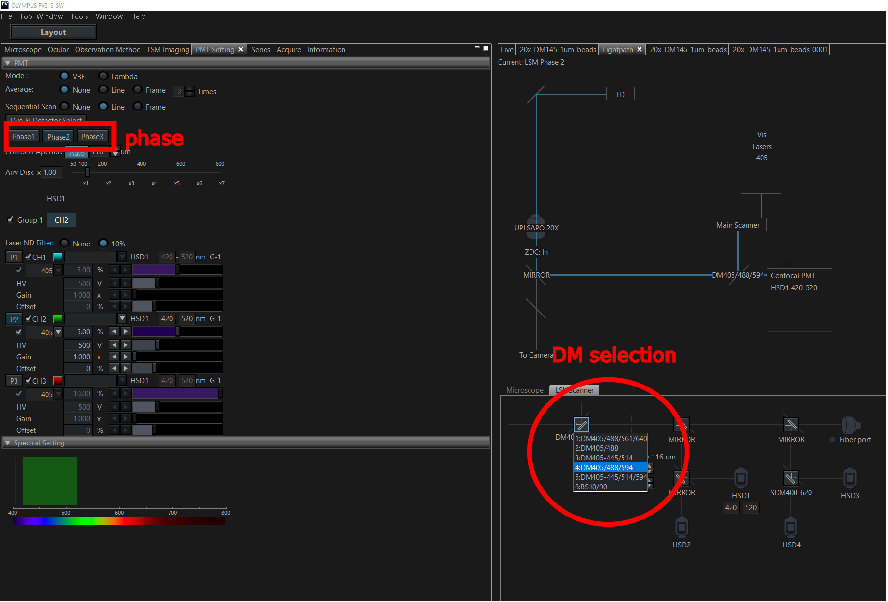

# Which dichroic mirrors did I use to acquire my images?

### 1 Open image file
Open the image file (oir extension) in the Olympus software.

### 2 Open sidebar menu
At the top-left corner of the image window there is an arrow icon. Clicking on this icon will reveal a sidebar menu.

### 3 Load acquisition parameters
Select the **Property** tab on the sidebar. At the top of the tab is a button with a cog and arrow icon. Clicking on this button will load the image's acquisition parameters into the current session.

### 4 Inspect lightpath
Next open the **Lightpath** tool window.
**Tool Window -> Lightpath**

### 5 Note DM used in each phase

