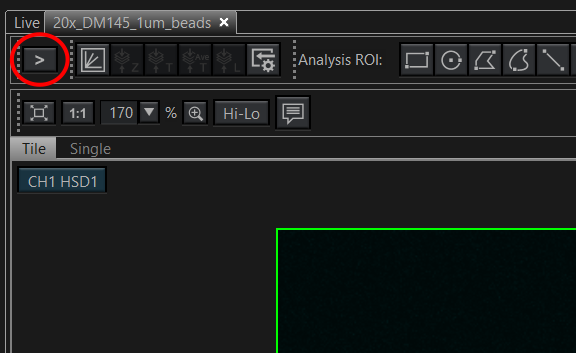
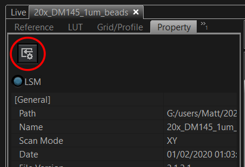
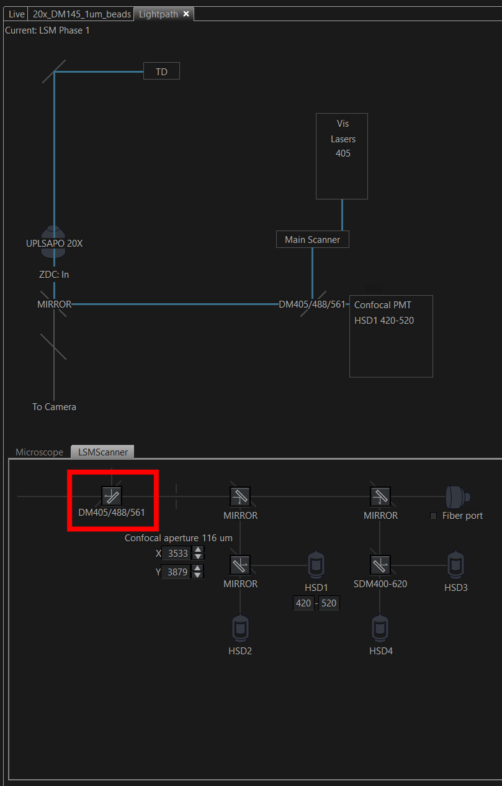

# Which dichroic mirrors did I use to acquire my images?

Open image (oir file).
Properties load acquisition parameters.

### 1 Open image (oir) file

### 2 Open side bar

### 3 Load acquisition parameters

### 4 Inspect lightpath

**Tool Window -> Lightpath**

