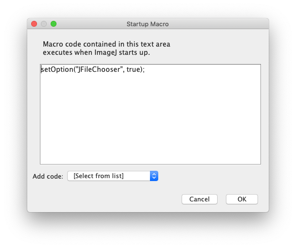

# Notes for users of Mac OS X

On Mac OS X titles are not displayed on file dialogs, such as "open file" and "choose directory". However, you can easily configure ImageJ to display titles on file dialogs:

Go to **Edit -> Options -> Startup...**

This will display the following dialog box which enables you to add/edit macro code to be run on startup.



```
setOption("JFileChooser", true);
```
