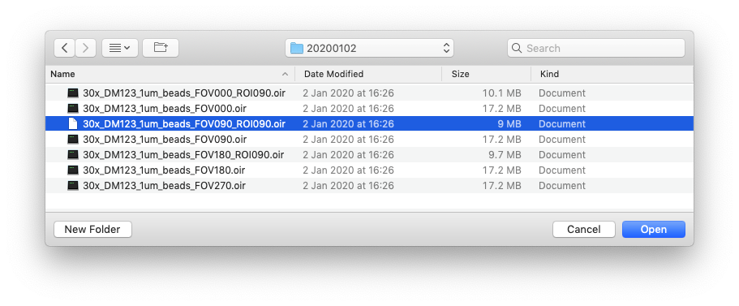
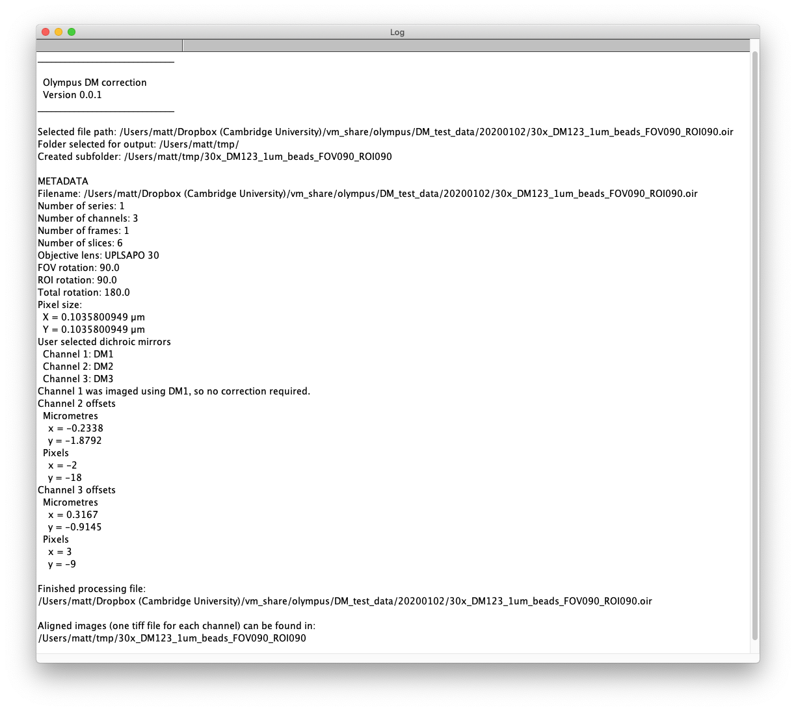
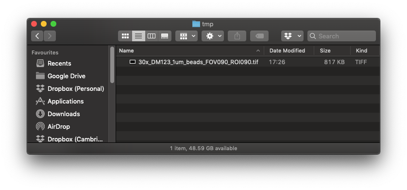
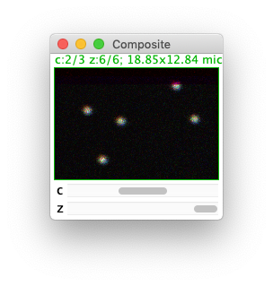
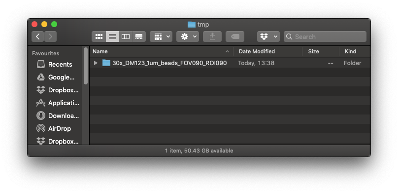
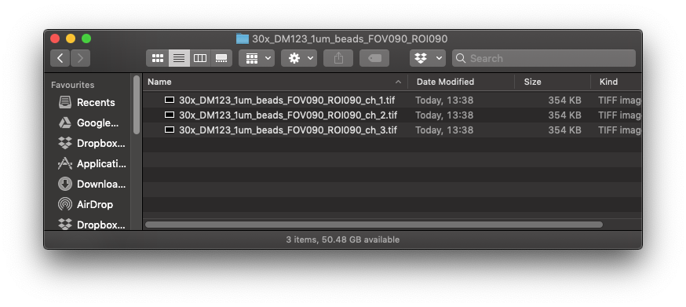

# Olympus DM correction 

## Purpose
This ImageJ plugin corrects the alignment of channels in indvidual Olympus oir image files. For batch processing see [Olympus DM correction batch](https://github.com/WaylandM/dichroic-mirror-offsets/blob/master/docs/batch_plugin.md).

## Example image sequence
To demonstrate use of the plugin we will take the example of the following fluoresent bead image:

The image comprises 3 channels (captured with DMs 1-3) and six slices. The field of view was rotated through 90 degrees. Furthermore, a region of interest within the field of view was rotated through a further 90 degrees. The plugin uses a [rotation matrix](https://en.wikipedia.org/wiki/Rotation_matrix) to adjust the offsets for rotated images.

## 1. Launch plugin
**Plugins -> Zoology Imaging Facility -> Olympus DM correction**

**N.B. The Olympus oir file doesn't need to be open when you start the plugin. If you have large image files to process it is best not to have any images open in ImageJ/Fiji, to maximize the memory available to the plugin.**

## 2. Choose Olympus oir file 
On starting the plugin you will be prompted to select the Olympus oir file to be processed.

The plugin will not make any changes to the Olympus oir file. The aligned channel images will be output as new tif files.

## 3. Match image channels to DMs
The plugin uses [BioFormats](https://www.openmicroscopy.org/bio-formats/) to extract almost all of the metadata (*e.g.* objective lens, pixel size, rotation of field of view, rotation of region of interest) it needs to process the image file. However, as far as I can tell, BioFormats doesn't report which DM was used to acquire each channel. This means we have to manually match each channel to its DM. Channels are numbered from 1 following the Olympus convention.

If you would like the plugin to output a single tif file containing all channels, tick the **Merge channels** checkbox, otherwise a tif file will be output for each channel.

When you have matched each channel to its DM click **OK** to proceed.

## 4. Choose colour for each channel
If you asked the plugin to output a composite image, by ticking the **Merge channels** checkbox in the previous dialog, you will be prompted to select a lookup table (LUT) colour for each channel.

Match each of your channels to one of the seven available colours and then click **OK**.

## 5. Choose output directory
Next you will be prompted to choose the directory into which the aligned channel images should be output.

Once you have selected an output directory the oir file will be processed.

***N.B. The plugin does not display images at any stage of processing.***

## 6. Log
Progress is reported in the ImageJ/Fiji log.

The log reports the version of the plugin used along with details of the translation applied to each channel. To keep the log for your records, select the log window, then from the ImageJ/Fiji **File** menu choose **Save As...***.

## 6. Inspect output
Go to the directory you selected for output. 
### Composite images
If you chose the **Merge channels** option a composite image will be output as a single tif file.

If you open this tif file in ImageJ/Fiji you should find that all channels are correctly aligned.

### File for each channel
If you opted not to merge channels into a composite image, three tif files will be output, one for each of the channels in the original Olympus oir file. Within the directory you selected for output you will find a subdirectory with the same name as your Olympus oir file, but with the *.oir* extension removed:

Inside this subdirectory you will find the tif files.  

The filename suffix denotes the channel. For example the file with the following name would contain the image for channel 1:

30X_DM123_1um_beads_FOV090_ROI090_***ch_1***.tif

